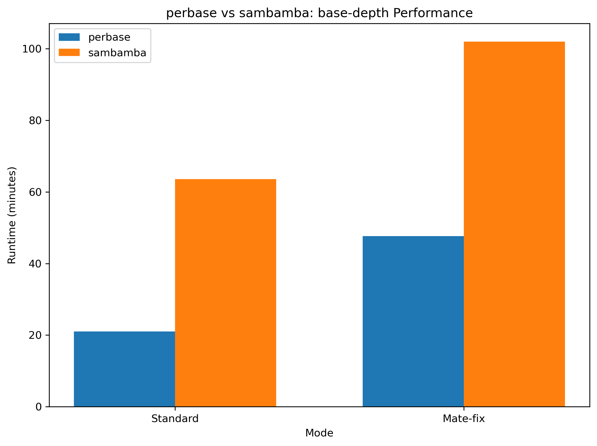

# Summary

`perbase` is a command-line toolkit for calculating per-base sequencing metrics from alignment files (BAM/CRAM). The primary tool, `base-depth`, provides comprehensive nucleotide-level information including depth, base composition, insertions, deletions, and quality metrics at each genomic position. Built with Rust's concurrency system, `perbase` delivers performant processing of high-throughput sequencing data while maintaining correctness in complex genomic contexts such as overlapping mate pairs, deletions, and reference skips.

# Statement of need

Per-base sequencing metrics are fundamental to genomic analyses, from variant calling to coverage assessment. Existing tools like `sambamba depth` [@Tarasov2015], `samtools depth` [@Li2009], `mosdepth` [@Pedersen2018], and `bam-readcount` [@Khanna2022] provide similar functionality but may differ in their handling of specific alignment features. As sequencing datasets grow larger, there is a need for tools that combine performance with correct handling of edge cases. 

For instance, tools differ in how they calculate depth: `perbase` counts deletions (D in CIGAR) toward depth while `bam-readcount` does not; `perbase` correctly excludes reference skips (N in CIGAR) from depth while `sambamba` includes them. These distinctions matter for downstream analyses where accurate depth representation affects variant calling and coverage assessment.

# Implementation

`perbase` is implemented in Rust and uses a multi-threaded architecture where genomic regions are processed in parallel. The toolkit automatically scales with available CPU cores while maintaining bounded memory usage through configurable chunk sizes and message passing buffers.

## Core Features of base-depth

The `base-depth` tool walks over every position in the BAM/CRAM file and calculates:

- **Depth**: Total count of A, C, G, T nucleotides plus deletions at each position
- **Base composition**: Individual counts for A, C, G, T, and N nucleotides
- **Insertions**: Count of insertions starting to the right of each position
- **Deletions**: Count of deletions covering each position (included in depth)
- **Reference skips**: Count of reference skip operations (not included in depth)
- **Failed reads**: Count of reads failing user-specified filters at each position
- **Quality filtering**: Bases below a minimum quality threshold are counted as N
- **Near max depth flag**: Identifies positions within 1% of the specified maximum depth

### Mate-Pair Overlap Resolution

When the `--mate-fix` flag is enabled, `perbase` resolves overlapping mate pairs by selecting the mate with the highest mapping quality (MAPQ), breaking ties by choosing the first mate that passes filters. Discarded mates are not counted toward depth or failed read counts. This prevents double-counting while preserving the highest-confidence base calls.

### Output Format

The tool produces a tab-separated output with the following columns:

| Column | Description |
|--------|-------------|
| REF | Reference sequence name |
| POS | Position on the reference sequence |
| REF_BASE | Reference base at the position (if reference supplied) |
| DEPTH | Total depth: SUM(A, C, G, T, DEL) |
| A, C, G, T, N | Count of each nucleotide |
| INS | Insertions starting after this position |
| DEL | Deletions covering this position |
| REF_SKIP | Reference skips covering this position |
| FAIL | Reads failing filters at this position |
| NEAR_MAX_DEPTH | Flag if position is within 1% of max depth |

## Additional Tools

**only-depth**: Provides rapid depth-only calculations. The design, inspired by `mosdepth` [@Pedersen2018], merges adjacent positions with identical depth to reduce output size. A `--fast-mode` option calculates depth using only read start/stop positions for maximum speed.

**merge-adjacent**: A utility for merging adjacent intervals with the same depth value, useful for creating compact coverage representations.

# Performance Evaluation

To demonstrate performance, we benchmark `base-depth` against commonly used tools on a 30X whole genome sequencing dataset (HG00157 from the 1000 Genomes Project). The benchmark script processes the full genome and measures runtime and memory usage.

The results show that `perbase` significantly outperforms `sambamba` in both standard and mate-fix modes, with speed improvements of 3.0x and 2.3x respectively. This performance advantage is achieved through efficient parallelization and optimized memory access patterns.

# Availability and Installation

`perbase` is available through multiple channels:
- Conda: `conda install -c bioconda perbase`
- Cargo: `cargo install perbase`
- Pre-compiled binaries from GitHub releases: https://github.com/sstadick/perbase/releases

Source code is available at https://github.com/sstadick/perbase under the MIT license.

# Acknowledgements

We acknowledge the Rust bioinformatics community and the authors of key dependencies including rust-htslib.

# References